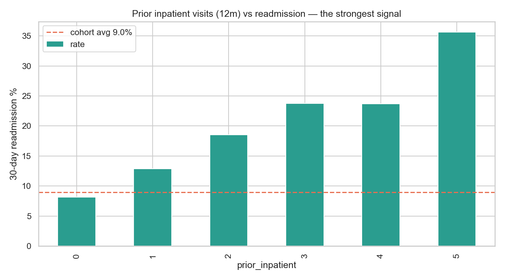
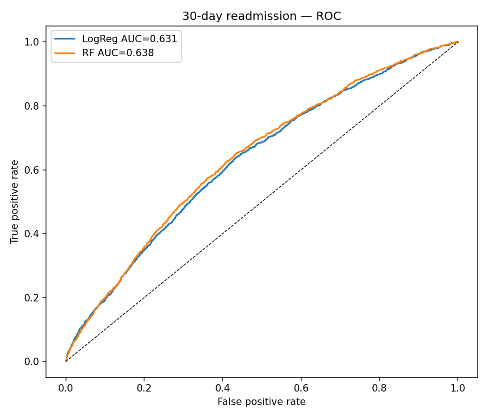
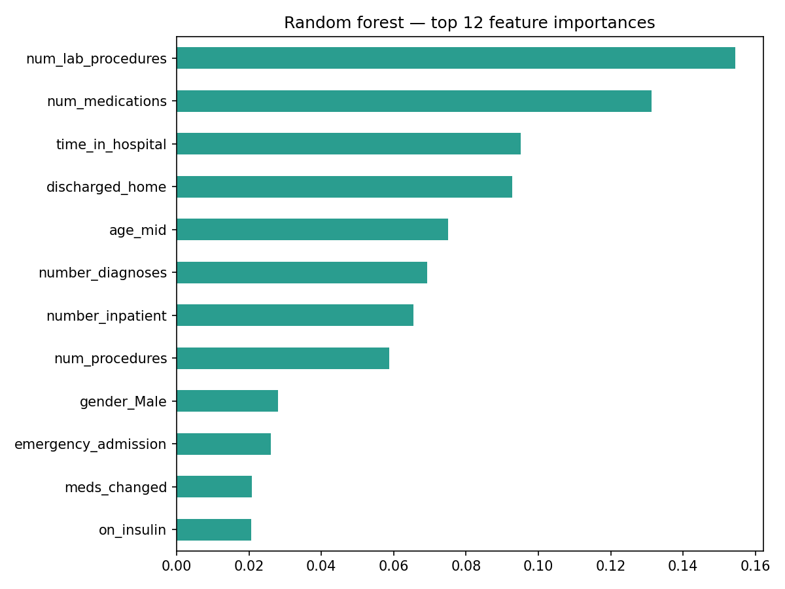
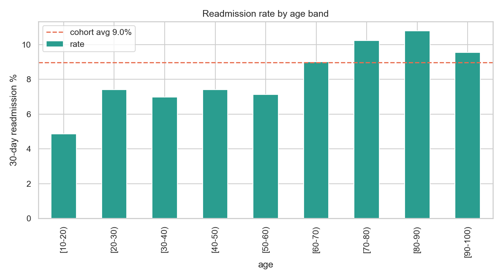
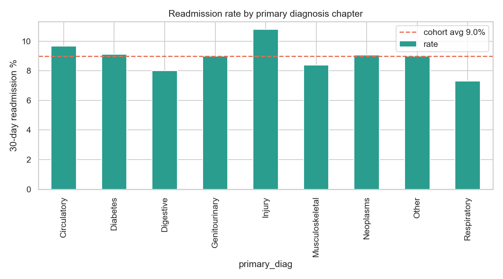
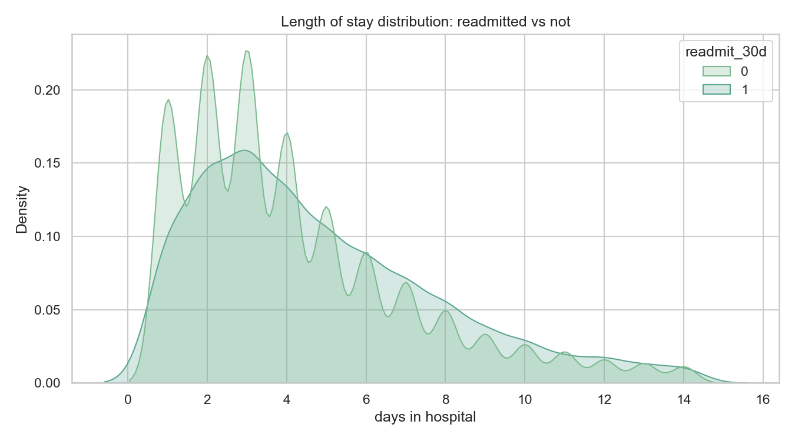
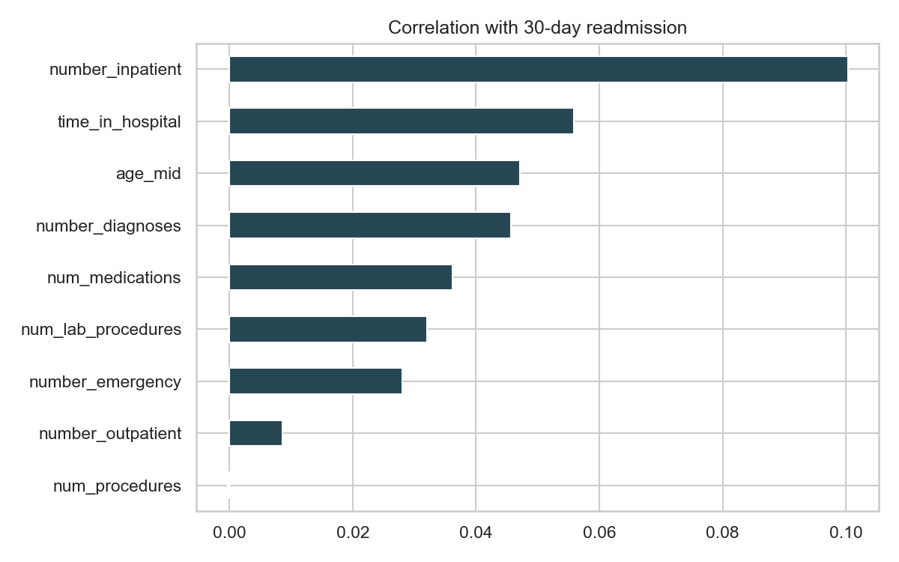

# Healthcare Readmission Analytics — 30-Day Diabetes Readmissions

**Business question:** which hospitalised diabetes patients will bounce back within 30 days — and what should the hospital do about it?

30-day readmissions are the metric US hospitals are penalised on (CMS HRRP), and the discharge-planning team can only intervene *before* the patient leaves. This project analyses **101,766 encounters across 130 US hospitals** (UCI "Diabetes 130-US hospitals", 1999–2008) end-to-end: SQL cohort analysis → hypothesis tests → risk model → operational recommendation.

**Stack:** MySQL 8.0 · Python (pandas, scipy, scikit-learn, seaborn) · SQL window functions

## Headline findings

1. **Prior utilisation is the dominant signal.** Readmission climbs monotonically from **8.1%** (no inpatient stay in the prior year) to **35.6%** (5+ prior stays) — χ²(3)=664.7, p<10⁻¹⁴³. The "frequent flyer" is identifiable *on admission day*.
2. **Where the patient goes next matters almost as much.** Discharge to a rehab facility carries a **27.7%** readmission rate vs **9.3%** for discharge home.
3. **Measuring HbA1c is associated with fewer readmissions** (8.4% vs 9.1%, p=0.011) — replicating the original Strack et al. (2014) finding. Association, not causation: the test likely proxies attentive diabetes management.
4. **A simple model turns this into an operating decision.** A random forest on 31 pre-discharge features reaches **ROC-AUC 0.64**; the top risk decile readmits at **17.1%** vs 3.5% for the bottom decile, and targeting the **top 30% of patients captures 48% of all 30-day readmissions**.

**Recommendation:** score every patient at discharge; route the top three risk deciles to transitional care (48–72h phone follow-up, medication reconciliation, PCP appointment within 7 days). Every input the model needs is known before the patient leaves the building.

## Results

### The frequent-flyer effect — the strongest signal in the data


### Model performance — ranking risk, not guessing individual outcomes
<table>
<tr>
<td width="50%"></td>
<td width="50%"></td>
</tr>
</table>

### Supporting exploratory analysis
<table>
<tr>
<td width="50%"></td>
<td width="50%"></td>
</tr>
<tr>
<td width="50%"></td>
<td width="50%"></td>
</tr>
</table>

## Analysis honesty notes (read before quoting numbers)

- Cohort for stats/model = **69,990**: one encounter per patient (prevents the same patient leaking into train and test) and excludes patients who died or went to hospice (they cannot be readmitted). The raw SQL layer keeps all 101,766 encounters.
- Positives are ~9% — models use `class_weight=balanced` and are judged on **ROC-AUC / PR-AUC, never accuracy** (predicting "no readmission" for everyone is 91% accurate and worthless).
- AUC ≈ 0.64 is consistent with the published literature on this dataset; readmission is genuinely hard to predict from claims-style data. The value is in the *ranking* (decile lift), not in individual predictions.
- `weight` (97% missing), `payer_code` and `medical_specialty` (~40–50% missing) were excluded rather than imputed.

## Repo layout

```
data/     diabetic_data.csv (101,766 × 50), IDS_mapping.csv
sql/      01_schema.sql · 02_analysis_queries.sql (10 cohort queries, CTEs + window functions)
src/      prep.py (cleaning rules) · load_to_mysql.py · eda.py · stats_tests.py · model.py
reports/  sql_results.txt · eda_summary.md · stats_tests.md · model_results.md · figures/*.png
```

## Reproduce

```bash
pip install -r requirements.txt

# SQL layer (optional — needs MySQL 8):
mysql -u root -p < sql/01_schema.sql
python src/load_to_mysql.py                    # DB_USER/DB_PASSWORD env vars if not root
mysql -u root -p -t healthcare_analytics < sql/02_analysis_queries.sql

# Python analysis (no DB needed):
cd src
python eda.py          # figures + cohort summary
python stats_tests.py  # chi-square, t-test, z-test write-ups
python model.py        # logistic regression + random forest, decile lift
```

## Data source

Strack et al., *"Impact of HbA1c Measurement on Hospital Readmission Rates: Analysis of 70,000 Clinical Database Patient Records"*, BioMed Research International 2014. Dataset: [UCI ML Repository #296](https://archive.ics.uci.edu/dataset/296/diabetes+130-us+hospitals+for+years+1999-2008).
